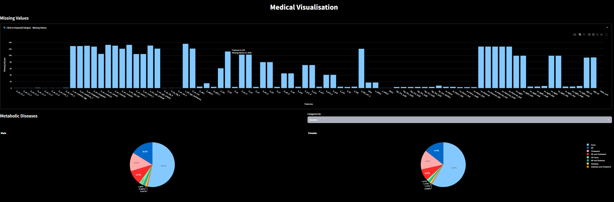
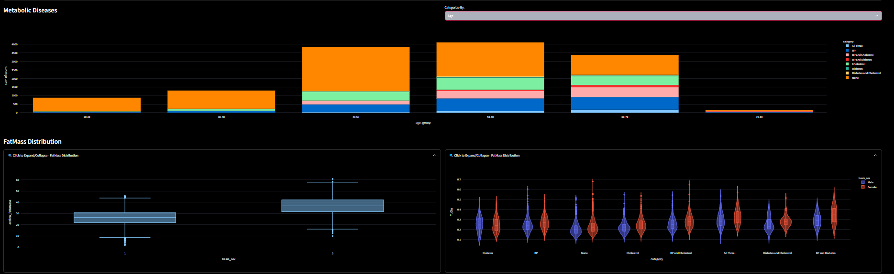

Evaluated and compared various feature ranking methods in the context of identifying diabetes risk predictors across two distinct tabular datasets. The findings contribute to model interpretability and to enhance trust in AI-driven disease risk prediction, supporting its adoption in clinical settings.
Here are some snapshots from the application:
 

 

